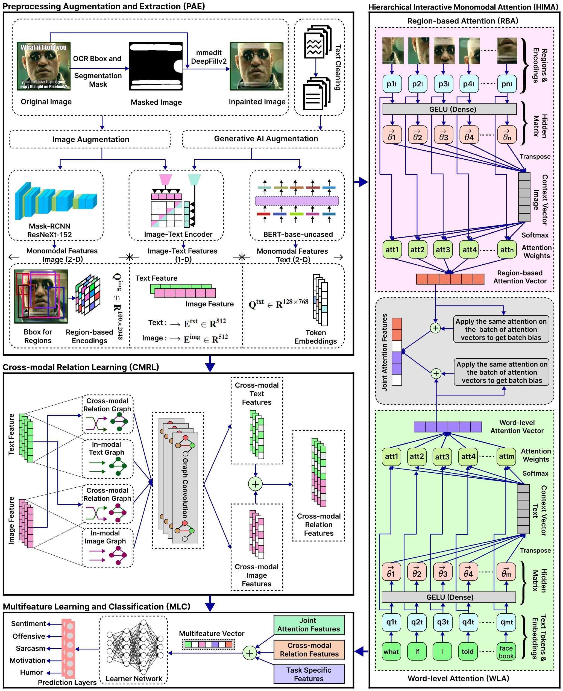

# MM-ORIENT: A Multimodal-Multitask Framework for Semantic Comprehension

The multimodal learning methods have constantly focused on acquiring a proficient joint multimodal representation. However, the intricate fusion techniques employed to create multimodal features result in the neglect of discriminative information contained within the monomodal features. Moreover, monomodal representation inherently contains noise, which influences latent multimodal representations when these representations are obtained through explicit cross-modal interaction among different modalities. To this end, we propose a multimodal-multitask framework with cross-modal relation and hierarchical interactive attention that is effective for multiple tasks.

## Project Structure

```
MM-ORIENT/
├── src/                               
│   ├── __init__.py                    
│   └── model.py                       
├── utils/                             
│   ├── __init__.py                    
│   └── label_utils.py                 
├── scripts/                           
│   ├── augmentation/                  
│   │   ├── few_shot_prompting.py
│   │   └── image_transformation.py
│   ├── feature_extraction/            
│   │   ├── img_mrcnnx152_features.py
│   │   ├── imgtxt_clip_features.py
│   │   └── txt_bert_features.py
│   └── preprocessing/                 
│       ├── mask_inpaint.py
│       └── preprocess_text.py
├── requirements.txt                   
└── README.md                          
```


## Architecture




## Methodology

MM-ORIENT performs semantic comprehension of memes through a multimodal–multitask architecture, combining Hierarchical Interactive Monomodal Attention (HIMA) and Cross-modal Relation Learning (CMRL).

- **Data Preprocessing**
  - **Image Masking & Inpainting**: Remove overlaid meme text using Mask-RCNN-based segmentation and gated convolution inpainting, preserving underlying visual content.
  - **Text Cleaning**: Remove special characters, URLs, usernames; normalize case and spacing for cleaner textual input.

- **Data Augmentation**
  - **Image Augmentation**: Random horizontal flips, brightness/contrast/hue/saturation adjustments.
  - **Text Augmentation**: GPT-3.5 few-shot prompting to rephrase each caption into multiple semantically equivalent variations.

- **Feature Extraction**
  - **CLIP Encoder**: Generate 512-dim joint image-text embeddings for cross-modal relation learning.
  - **BERT-base-uncased**: Extract 768-dim token embeddings for text modality.
  - **Mask RCNN (ResNeXt-152)**: Extract 2048-dim region-based features from 100 detected image regions.
  - **Task-specific Features**: Extract emotion (NRCLex), sentiment (5-class), and toxicity features (RoBERTa Toxicity Classifier).

- **Hierarchical Interactive Monomodal Attention (HIMA)**
  - **Stage 1**: Word-level attention (WLA) and region-based attention (RBA) to focus on key words and visual regions.
  - **Stage 2**: Sentence-level and image-level attention to capture broader contextual patterns across the batch.
  - Outputs a joint attention feature vector combining both modalities.

- **Cross-modal Relation Learning (CMRL)**
  - Construct in-modal and cross-modal graphs using cosine similarity thresholds.
  - Apply GraphSAGE for feature reconstruction, leveraging neighborhood information from the other modality to reduce cross-modal noise.

- **Multifeature Learning & Classification**
  - Concatenate outputs from HIMA, CMRL, and task-specific features.
  - Pass through fully connected layers with separate softmax heads for five tasks: sentiment, humor, sarcasm, offensiveness, motivation.
  - Train with categorical cross-entropy loss summed over tasks.


 
## Tasks

- **Task A**: Overall sentiment classification (positive, negative, neutral)
- **Task B**: Binary classification for humor, sarcasm, offense, motivation
- **Task C**: Multi-class classification with intensity levels


## Running the Model
```python
from src.model import train_and_eval
from utils.label_utils import get_train_labels, get_test_labels

# Load your data and run training
# See src/model.py for detailed usage
```


## Data Paths Configuration

Update the placeholder paths in `src/model.py` with your actual data paths:

```python

dataframe = pd.read_csv("path/to/dataset/train_labels.csv")

# CMRL features
img_glob = np.load("path/to/clip_features/image_clip_train.npy")
text_glob = np.load("path/to/clip_features/text_clip_train.npy")

# HIMA features
img_monomodal_features = np.load("path/to/monomodal_features/image_features_train.npy")
text_monomodal_features = np.load("path/to/monomodal_features/text_features_train.npy")

# additional features
toxicity = np.load("path/to/additional_features/roberta_features_train.npy")
nrclex = np.load("path/to/additional_features/nrclex_features_train.npy")
stanford = np.load("path/to/additional_features/corenlp_features_train.npy")

...

```


## Requirements

- Python >= 3.7
- TensorFlow >= 2.8.0
- TensorFlow Hub >= 0.12.0
- Keras >= 2.8.0
- Pandas >= 1.3.0
- NumPy >= 1.21.0
- Scikit-learn >= 1.0.0
- Spektral >= 1.2.0
- Scikit-image >= 0.19.0

For complete dependencies, see `requirements.txt`.

## License

This project is licensed under the MIT License - see the [LICENSE](LICENSE) file for details.
